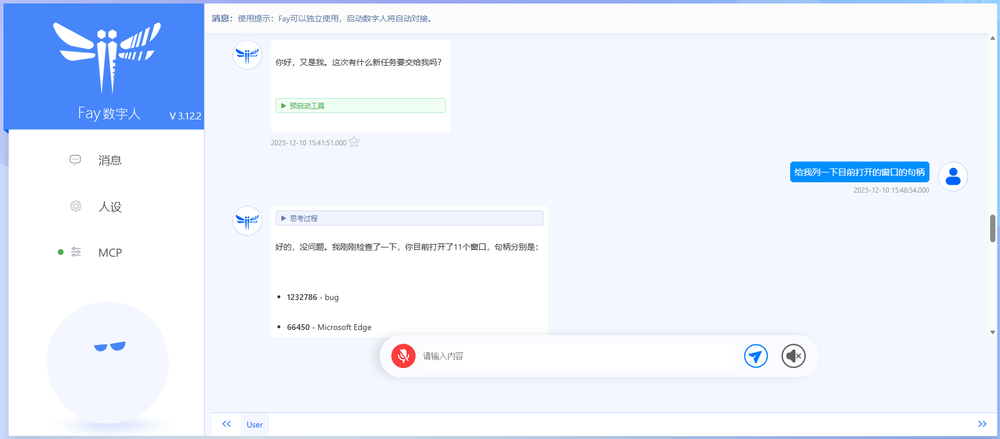
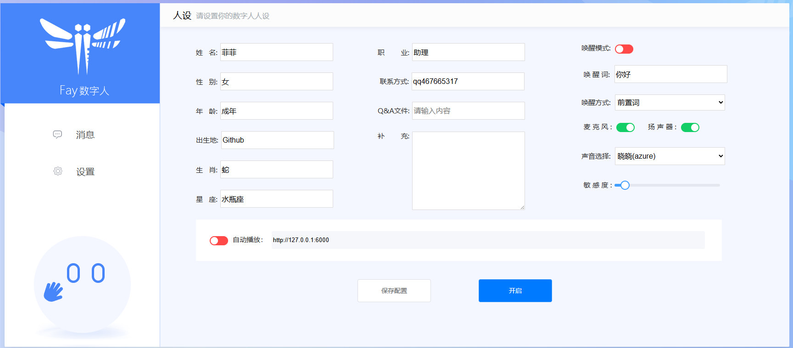
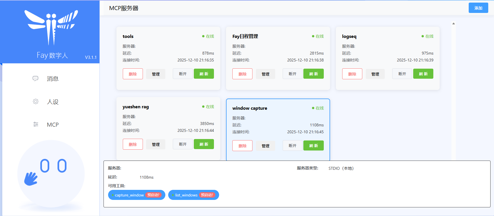

<div align="center">
    <br>
    
    <h1>FAY</h1>
	<h3>Fay数字人框架</h3>
</div>

！！重要通知：我们已经把Fay的三个版本合并成1个，并致力提供更稳定更全面的功能。

我们致力于思考面向终端的数字人落地应用，并通过完整代码把思考结果呈现给大家。Fay数字人框架，向上适配各种数字人模型技术，向下接入各式大语言模型，并且便于更换诸如TTS、ASR等模型，为单片机、app、网站提供全面的数字人应用接口。      
更新日志：https://qqk9ntwbcit.feishu.cn/wiki/UlbZwfAXgiKSquk52AkcibhHngg
文档：https://qqk9ntwbcit.feishu.cn/wiki/JzMJw7AghiO8eHktMwlcxznenIg


## **功能特点**


- 完全开源，商用免责
- 支持全离线使用
- 全时流式的支持
- 自由匹配数字人模型、大语言模型（openai 兼容接口）、ASR、TTS模型
- 支持数字人自动播报模式（虚拟教师、虚拟主播、新闻播报）
- 支持任意终端使用：单片机、app、网站、大屏、三方业务系统接入等
- 支持多用户多路并发
- 提供文字交互接口、语音交互接口、数字人驱动接口、管理控制接口、自动播报接口、意图接口
- 支持语音指令灵活配置执行（qa.csv）
- 支持自定义知识库、自定义问答对、自定义人设信息
- 支持唤醒及打断对话
- 支持服务器及单机模式
- 支持机器人表情输出
- 支持agent自主决策工具调用
- 基于日程式数字人主动对话
- 支持后台静默启动
- 支持deepseek等thinking llm
- 自我认知提高
- 仿生记忆
- 支持MCP工具管理（sse、studio）
- 提供配置管理中心
- 全链路交互互通

###               

## **Fay数字人框架**








## **源码启动**


### **环境** 
- Python 3.12

- Windows、macos、ubuntu

- 注：ubuntu需要先安装gcc及portaudio

- ````bash
  sudo apt update
  sudo apt install build-essential
  sudo apt install portaudio19-dev
  ````

  

### **安装依赖**

```shell
pip install -r requirements.txt
```


### **快速启动**
本地
```shell
python main.py start -config_center d19f7b0a-2b8a-4503-8c0d-1a587b90eb69  #使用公共资源，速度非常慢，建议更换成自己的key
```
镜像
```shell
https://www.compshare.cn/images/compshareImage-1cft3sk9gvta?ytag=GPU_fay
```

### **Docker Compose 部署 Fay 与配置管理中心**

项目根目录的 Compose 配置会同时启动 Fay、[fay_config_server](https://github.com/xszyou/fay_config_server) 和 [mate-human](https://gitee.com/garveyer/mate-human)。配置中心使用 `5500` 端口，Fay 管理页面使用 `5000` 端口，Fay 内置 MCP 管理服务使用 `5010` 端口，Mate Human 前端使用 `5173` 端口。

1. 创建本地 Compose 环境变量文件：

```shell
cp .env.example .env
```

2. 构建并启动三个服务：

```shell
docker compose up -d --build
```

3. 首次使用时打开配置中心 `http://127.0.0.1:5500`，使用默认账号登录：

```text
用户名：admin
密码：admin
```

创建新项目时，将项目路径填写为配置中心容器内的：

```text
/source/fay
```

保存项目后，从浏览器地址 `/project/<项目UUID>/config` 中复制项目 UUID，写入 `.env`：

```dotenv
FAY_CONFIG_CENTER_ID=<项目UUID>
```

然后重启 Fay：

```shell
docker compose up -d fay
```

Fay 容器通过 `http://fay-config-server:5500` 访问配置中心，两个服务共用 `.env` 中的 `FAY_CONFIG_CENTER_API_KEY`。配置中心项目数据保存在 Docker 命名卷 `fay_config_projects` 中；在配置中心修改配置后，重启 Fay 才会重新加载：

```shell
docker compose restart fay
```

查看运行状态和日志：

```shell
docker compose ps
docker compose logs -f fay fay-config-server
```

Mate Human 是 Live2D 前端，Compose 会从 `mate-human/` 目录构建静态资源并由 Nginx 提供服务。浏览器访问：

```text
http://127.0.0.1:5173
```

前端通过浏览器访问宿主机已映射的 Fay `10002` WebSocket 和 `5000` 音频接口，因此源码中的 `127.0.0.1` 指向运行浏览器的本机，不应改成 Compose 内部的 `fay` 服务名。

### **个性化配置**
+ 根目录system.conf.bak 重命名为system.conf，并配置里面的内容

### **管理页面**
+ 浏览器访问 http://127.0.0.1:5000
+ MCP 管理页面访问 http://127.0.0.1:5010/Page3

## **高级玩法**


### ***使用数字人（非必须）***
https://qqk9ntwbcit.feishu.cn/wiki/GHevwqxwfiX4hCk8yJCcoJ54nqg


### ***集成到自家产品（非必须）***
https://qqk9ntwbcit.feishu.cn/wiki/Mcw3wbA3RiNZzwkexz6cnKCsnhh


### **联系**

**交流群及资料教程**关注公众号 **fay数字人**（**请先star本仓库**）


**商务联系**

qq467665317


## **致谢**

感谢以下开源项目为 Fay 提供的技术支持：

- [openclaw](https://github.com/openclaw/openclaw) - 提供记忆机制及skills设计的参考
- [OpenAI Codex](https://github.com/openai/codex) - 提供稳定的工具调用能力的参考
- [FunASR](https://github.com/modelscope/FunASR) - 提供语音识别（ASR）能力
